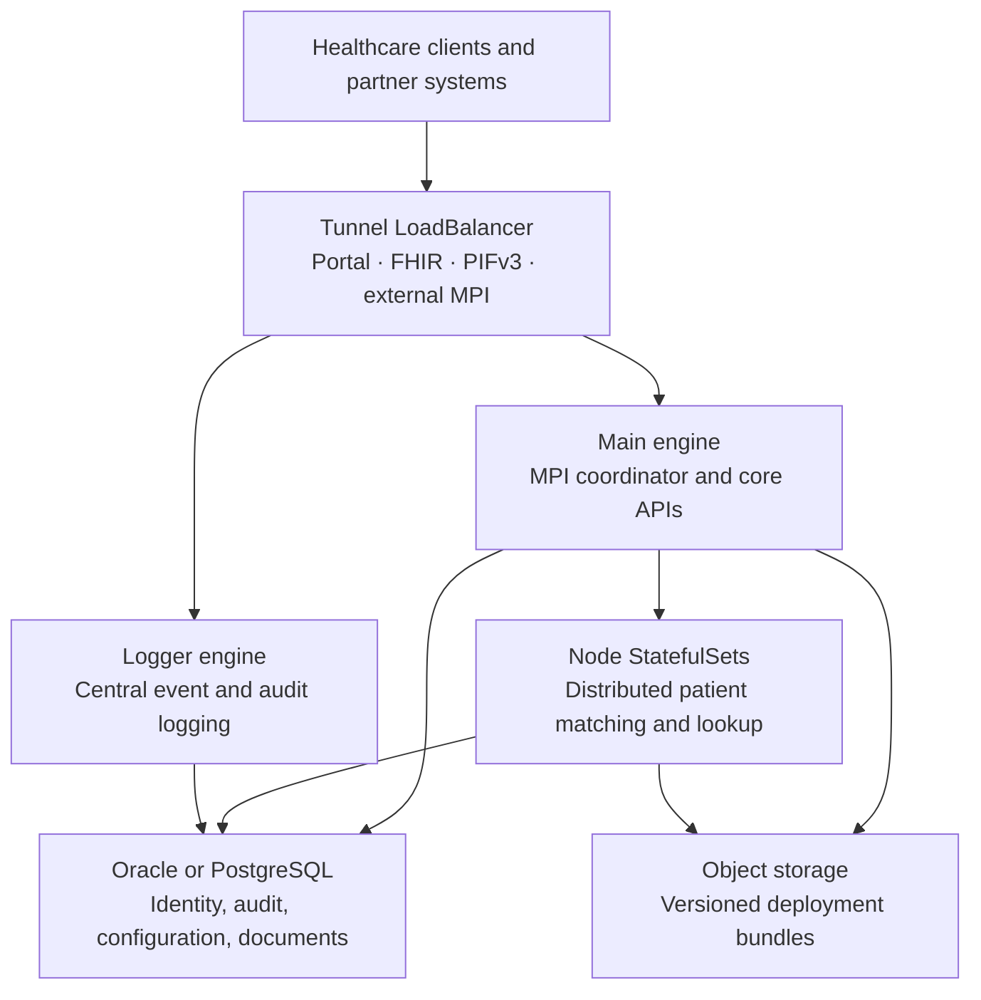
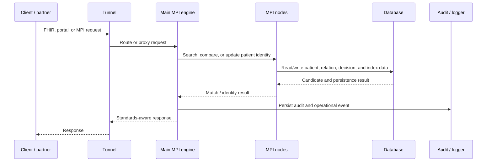

# MPI HIE Engine — Presentation Brief

## Executive summary

This repository is the deployment and runtime definition of a **Master Patient
Index (MPI) Health Information Exchange (HIE)** platform. It packages a
containerized Java engine, Kubernetes/Helm topology, database schema,
interoperability configuration, and CI/CD automation used to operate patient
identity and clinical-data exchange workloads.

It is not the engine's source-code repository. The Java business implementation
is delivered as compiled JARs; this repository specifies how those components
are configured, connected, secured, deployed, and operated.

## How to introduce it

> This platform provides the operational foundation for resolving patient
> identities across healthcare systems and exposing those identities through
> standards-based interoperability interfaces. It combines a distributed MPI,
> FHIR and portal APIs, persistent auditability, and Kubernetes-native
> deployment controls.

## Architecture

## Request and processing flow

## Core capabilities

### 1. Master Patient Index

- Matches, searches, creates, updates, merges, and deletes patient identities.
- Connects a local patient record to an enterprise/HIE identity.
- Maintains candidate matches, match decisions, patient relations, source
  systems, review queues, and audit history.
- Supports high-availability coordination and remote/distributed MPI nodes.

### 2. Healthcare interoperability

- FHIR server and handlers for patient/search/document-style interactions.
- XDS/document exchange and HL7-related processing components.
- Portal and administrative interfaces.
- PIFv3 and external/remote MPI pathways for partner integration.

### 3. Enterprise persistence and traceability

- Oracle and PostgreSQL schemas plus migration and maintenance scripts.
- Persistent identity tables: `MPI2_HIE_PATIENT`, `MPI2_LOCAL_PATIENT`,
  `MPI2_RELATION`, `MPI2_DECISION`, and `MPI2_BUCKET`.
- Change, audit, migration, HA, roster, and review-queue records make patient
  identity decisions traceable and recoverable.

### 4. Cloud-native operations

- Helm packages the full topology: main, logger, tunnel, and distributed node
  StatefulSets.
- Persistent volumes preserve runtime and engine state.
- Health probes, graceful shutdown behavior, central logging, and metrics are
  built into deployment definitions.
- CI/CD builds/pushes OCI images, uploads encrypted deployment bundles to
  object storage, packages Helm charts, and creates a rollback artifact.

### 5. Security model

- Kubernetes secrets supply object-storage and database credentials.
- Oracle wallet support is configured for database connectivity.
- Registry credentials and external build secrets are retrieved through OCI
  DevOps/Vault integration.
- The deployment bundle is retrieved at startup rather than embedding
  environment-specific deployment content into every image.

## What makes this more than CRUD

CRUD is present, but it is not the core differentiator. A simple CRUD service
stores one entity in one database. This platform must decide whether records
from many systems represent the same person, preserve that decision, synchronize
it across nodes, expose it through healthcare standards, and retain an audit
trail.

```mermaid
flowchart LR
    Input["Patient record or FHIR request"]
    Normalize["Normalize and validate"]
    Candidates["Find candidate identities"]
    Match["Compare and match"]
    Decision["Create, update, merge, or reject"]
    Persist["Persist identities, relations, decisions, and audit"]
    Distribute["Coordinate distributed nodes and downstream events"]
    Response["Return FHIR / portal / MPI response"]

    Input --> Normalize --> Candidates --> Match --> Decision --> Persist --> Distribute --> Response
```

## Performance story — what can be claimed

The repository supports a performance-oriented architecture. The following are
**design mechanisms**, not substitute claims for measured production SLOs:

- **Distributed execution:** the main engine coordinates a fleet of node
  StatefulSets rather than carrying all matching work in one process.
- **Indexed, node-local patient operations:** the MPI JAR exposes indexed node
  storage and patient loaders, which is consistent with avoiding repeated
  full-database scans for matching/search workloads.
- **Batch persistence:** the MPI persistence implementation batches patient,
  relationship, audit, bucket, decision, and change operations through prepared
  JDBC statements.
- **Connection pooling:** Hibernate/C3P0 is configured for pooled database
  access; the main profile sets a high database connection maximum.
- **Asynchronous and scheduled work:** audit queries, data loaders, HA updates,
  reporting, and recalculation can run asynchronously or on timers.
- **Workload separation:** external tunneling, logging, main coordination, and
  node processing are separated into distinct runtime roles.

Use this phrasing in a formal setting:

> The architecture is designed for high-throughput identity processing through
> distributed MPI nodes, indexed patient operations, batched database writes,
> pooled connections, and asynchronous maintenance workflows. Final latency and
> throughput claims require environment-specific benchmark evidence.

## Key USPs

| USP | Why it matters |
| --- | --- |
| Patient-identity intelligence | Links records from multiple clinical systems rather than treating them as isolated CRUD rows. |
| Standards-based integration | Supports healthcare-facing FHIR, XDS, HL7-related, and MPI exchange patterns. |
| Distributed MPI topology | Scales matching and lookup workloads beyond a single application instance. |
| Auditability by design | Retains identity decisions, changes, events, and reporting data. |
| Configurable runtime | A common engine image assumes main, node, logger, and tunnel roles using deployment configuration. |
| Operational maturity | Includes Helm, OCI CI/CD, object-storage artifacts, persistent volumes, secret integration, and rollback packaging. |

## Presentation boundaries

Avoid claiming a benchmark number, compliance certification, guaranteed
availability percentage, or specific matching accuracy unless supported by
production metrics or formal evidence. This repository demonstrates the
architecture and operational controls, not those measured outcomes.

## Source-code limitation

The engine's proprietary JARs can be unpacked, but the inspected artifacts
contain compiled `.class` files and no `.java` source. That permits inspection
of package names, classes, public methods, and some bytecode metadata, but not
authoritative line-by-line source review. The matching source repository and
release tag are required for that level of analysis.
