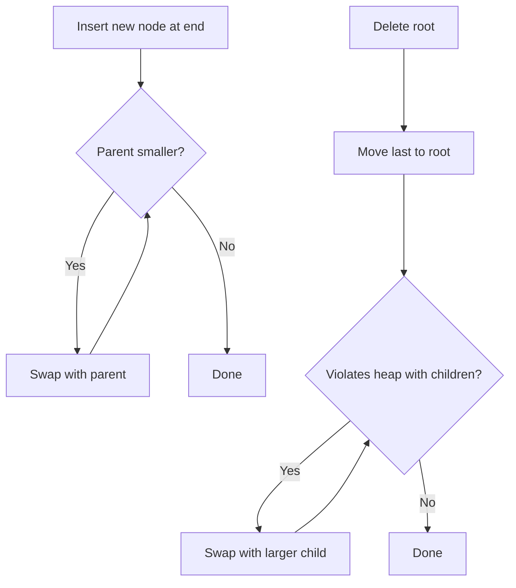

# Problem 3: InsertAndDelete.java (Max-Heap Operations)

## 1) Core objective
Support two operations on a max-heap:
- `insert(x)`
- `deleteRoot()` (remove max)

## 2) Formal progressive solution
## Insert operation
### Brute force
- Append and sort whole structure
- Correct but wasteful

### Better (standard)
1. Put new value at end
2. Bubble up while parent is smaller

### Complexity
- Time: `O(log n)`
- Space: `O(1)` if capacity available, `O(n)` if resizing array copy

## Delete root operation
### Brute force
- Remove root and rebuild/sort everything

### Better (standard)
1. Move last element to root
2. Reduce size
3. Bubble down by swapping with larger child until heap property restored

### Complexity
- Time: `O(log n)`
- Space: `O(1)` (excluding resize/copy)

## 3) Pitfalls to guard against
- Child existence checks (`left <= size`, `right <= size`)
- If only one child exists, still compare and potentially swap
- Avoid copying whole array every operation in production heap class

## 4) Why this matters in interviews
Many priority-queue problems are exactly repeated insert + repeated extract-max/min.
Understanding bubble-up and bubble-down is foundational.

## 5) Diagram

