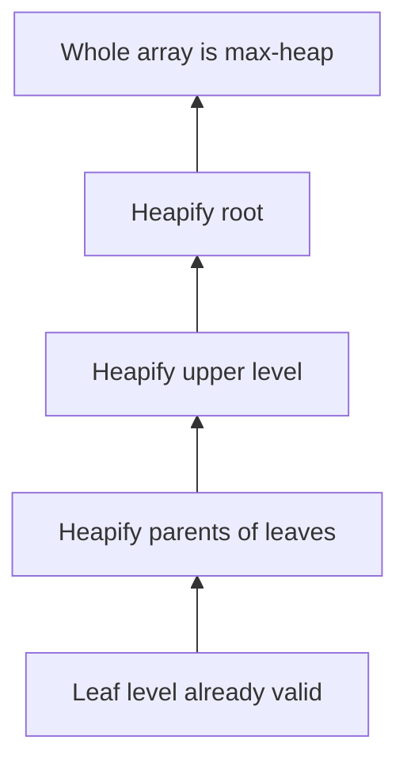

# Problem 4: MinToMaxHeap.java (Convert Min-Heap to Max-Heap)

## 1) Objective
Given a heap-like array, convert into a valid max-heap.

## 2) Brute force thought
### Idea A: Find largest and swap to top repeatedly
- Might fix root but breaks subtrees
- Not guaranteed to produce valid global max-heap

### Complexity (if repeated fixes)
- Can drift toward `O(n^2)` in poor designs

## 3) Correct structured approach
### Idea B: Bottom-up heap construction
1. Start from last internal node
2. Run `maxHeapify` on each internal node moving upward to root

Why it works:
- When heapifying a node, its children subtrees are already max-heaps.

### Complexity
- Time: `O(n)`
- Space: `O(1)` in-place

## 4) Common mistakes
- Using 0-based child formulas with 1-based arrays (or vice versa)
- Assuming one root swap is enough
- Not heapifying all internal nodes

## 5) Mental model
Converting to max-heap is not “put biggest at top once”; it is “enforce local parent>=children bottom-up everywhere.”

## 6) Diagram

